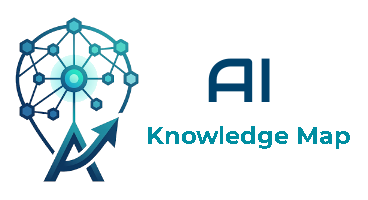

<h1 align="center">AI Knowledge Map</h1>

<p align="center">
  
</p>

<p align="center">
  <strong>An interactive map of the artificial intelligence landscape —<br>
  from foundational concepts to tools, ethics, governance, and risk management.</strong>
</p>

<p align="center">
  <a href="https://aiknowledgemap.org">🌐 aiknowledgemap.org</a> ·
  <a href="https://aiknowledgemap.org/pt-br/">🇧🇷 Português</a> ·
  <a href="https://aiknowledgemap.org/">🇺🇸 English</a> ·
  <a href="https://aiknowledgemap.org/es/">🇪🇸 Español</a>
</p>

<p align="center">
  
  
  
  
</p>

---

## 📖 About

The **AI Knowledge Map** is a curated, openly accessible visualization of the artificial intelligence ecosystem — from foundational concepts to tools, ethics, and governance.

The project began after postgraduate studies in Data Science and Artificial Intelligence at [Universidade Federal do Espírito Santo (UFES)](https://ufes.br/), motivated by a simple observation: **the field has plenty of textbooks and plenty of marketing material, but few resources sit comfortably between the two**. This map aims for that middle ground.

Definitions in AI vary across authors and schools of thought, so the descriptions deliberately favor breadth and clarity over rigid formalism — the goal is to be useful for newcomers without misleading specialists.

## ✨ Features

- 🌳 **Interactive tree** — click any node to expand or collapse its branch.
- 🔍 **Hover panels** — see short definitions and real-world model examples on the fly.
- 📋 **One-click copy** — grab the definition with an academic-style citation already attached, perfect for notes and papers.
- 🌗 **Dark mode** — easy on the eyes during long study sessions.
- 🌐 **Multi-language** — English, Portuguese (BR), and Spanish.
- 📱 **Responsive layout** — works on desktop and mobile.
- 🔎 **SEO-ready** — `sitemap.xml`, `hreflang`, Open Graph, and Twitter Cards built in.
- ⚡ **Static site** — no backend, no build step, instant deploys.

## 🛠️ Tech Stack

- **HTML5 / CSS3 / vanilla JavaScript** — zero framework overhead.
- **[D3.js v7](https://d3js.org/)** — for the collapsible hierarchical tree.
- **[Google Fonts](https://fonts.google.com/)** — Inter (UI) and Outfit (display).
- **Static hosting friendly** — GitHub Pages, Netlify, Cloudflare Pages, Vercel, S3, etc.

## 🚀 Getting Started

### Prerequisites

A simple local web server. The site uses `fetch()` to load `data.json`, so opening `index.html` directly via `file://` will be blocked by the browser's CORS policy.

### Run Locally

Clone the repository:

```bash
git clone https://github.com/gustavomartinellidev/aiknowledgemap.git
cd aiknowledgemap
```

Start a local server — pick whichever you have installed:

```bash
# Python 3
python3 -m http.server 8000

# Node.js (no install needed)
npx serve .

# PHP
php -S localhost:8000
```

Then open <http://localhost:8000> in your browser.

## 📁 Project Structure

```
aiknowledgemap/
├── index.html            # English (default locale)
├── pt-br/
|   ├── data.json
│   └── index.html        # Portuguese (BR) locale
├── es/
|   ├── data.json
│   └── index.html        # Spanish locale
├── css/
│   └── style.css         # Theme, layout, dark mode
├── js/
│   ├── app.js            # D3 tree logic, hover panel, copy-to-clipboard
│   └── d3.v7.min.js      # D3.js library
├── data.json             # Knowledge map dataset (the heart of the project)
├── aikm_img_name.png     # Logo
├── .gitignore
├── _headers
├── aikm_logo.jpg
├── android-chrome-192x192.png
├── android-chrome-512x512.png
├── apple-touch-icon.png
├── favicon-16x16.png
├── favicon-32x32.png
├── favicon.ico
├── sitemap.xml
├── robots.txt
├── site.webmanifest
├── LICENSE
├── CHANGELOG.md
└── README.md
```

## 🗺️ Roadmap

- [ ] **Full-text search** across all concepts.
- [ ] **Glossary view** as an alphabetical fallback to the tree.
- [ ] **Evaluation metrics deep-dives** — dedicated explanations for each model evaluation metric, covering when to use it, common pitfalls, and how to interpret it in real scenarios.
- [ ] **Hands-on Google Colab notebooks** — simple, ready-to-run training examples for the most common model types, so visitors can experiment with the concepts they just learned.

See the full list and propose new ideas in the [issues tab](https://github.com/gustavomartinellidev/aiknowledgemap/issues).

## 🤝 Contributing

Contributions are warmly welcomed — this map grows stronger with the AI community behind it.

Found an inaccuracy? Have a concept worth adding? Want to translate to a new language?

1. [Open an issue](https://github.com/gustavomartinellidev/aiknowledgemap/issues) describing what you'd like to change.
2. Fork the repository.
3. Create a feature branch: `git checkout -b feat/my-improvement`.
4. Commit your changes with a clear message.
5. Open a pull request linking the issue.

For content edits (definitions, new concepts), the main file you'll touch is `data.json`.

## 📜 License

Distributed under the **MIT License**. See [`LICENSE`](LICENSE) for the full text.

## 🙏 Acknowledgments

- **[OSINT Framework](https://osintframework.com/)** — for the inspiration and the open-source foundation that helped get this project off the ground 😉
- **[Universidade Federal do Espírito Santo (UFES)](https://ufes.br/)** — for the academic foundation in Data Science and Artificial Intelligence.
- **The AI community** — for the ongoing conversations, papers, and tools that fuel a project like this.

## 👤 Author

**Gustavo Martinelli**

- 🔗 LinkedIn: [@gustavomartinelli](https://www.linkedin.com/in/gustavomartinelli/)
- 🐙 GitHub: [@gustavomartinellidev](https://github.com/gustavomartinellidev)

---

<p align="center">
  ⭐ <strong>If this project helped you, consider starring the repo</strong> — it helps others find it.<br><br>
  Made with ❤️ for the AI community.
</p>
